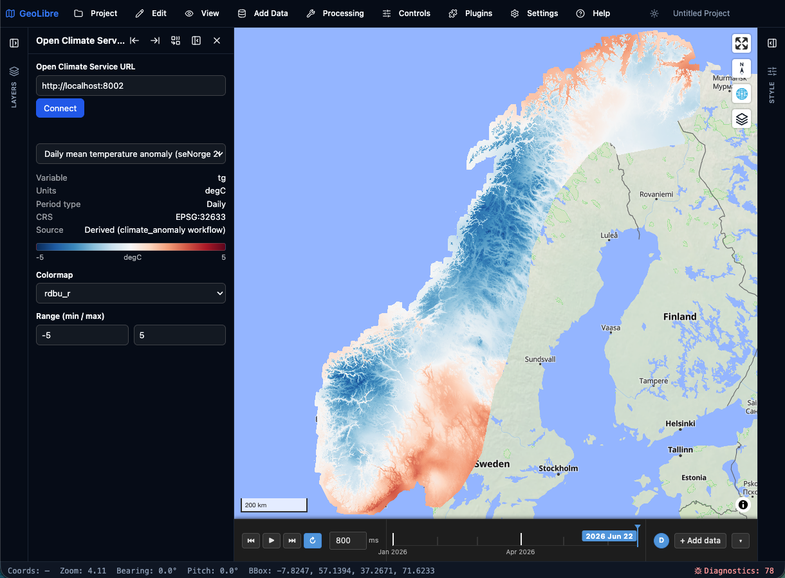

# Open Climate Service — GeoLibre plugin

A [GeoLibre](https://geolibre.app/) plugin that browses an **Open Climate Service** (OCS) STAC catalog and renders its published climate datasets — taking the CRS, time axis, and variable straight from the dataset's metadata, so nothing has to be entered by hand.

Learn more about Open Climate Service: **<https://dhis2.github.io/open-climate-service/>**



## Features

- Point at any OCS instance and browse its published datasets.
- Render a dataset as a map layer, listed in GeoLibre's Layers panel.
- CRS, the time slider, variable, colormap, and value range are all taken from the dataset — projected national grids land in the right place automatically.
- Deep-linkable via `?ocsUrl=…&dataset=…`, and your selection is saved with the GeoLibre project.

## Install

Download the latest `open-climate-service-<version>.zip` from the
[**Releases**](https://github.com/dhis2/open-climate-service-geolibre-plugin/releases) page, then in
GeoLibre go to **Settings → Manage Plugins → Install from file** and select the zip.

## Usage

1. Activate **Open Climate Service** from GeoLibre's **Plugins** menu.
2. In the panel, enter your OCS instance URL (e.g. `http://localhost:8002`) and click **Connect**.
3. Pick a dataset. The map frames the instance's region and draws the layer.
4. Step through periods with the **time slider** at the bottom of the map, and adjust the
   **colormap** and **value range** in the panel.

## Build from source

```bash
npm install
npm run package:geolibre   # typecheck + build + zip → geolibre-plugin/open-climate-service-<version>.zip
```

Then install the generated zip as above, or point GeoLibre at the unpacked `geolibre-plugin/` directory.

## Development

```bash
npm run typecheck   # tsc --noEmit
npm test            # vitest
npm run build       # typecheck + bundle to geolibre-plugin/dist
```

## Releases

Releases are automated, with `package.json` as the single source of truth for the version.
Bump the version in a pull request and merge it to `main`: CI builds the plugin and publishes a
GitHub Release (tag `v<version>`) with the installable zip attached. A merge that doesn't change
the version doesn't create a release, so the same version is never published twice.

## Status

Under active development — see the tracking issue
[dhis2/open-climate-service#301](https://github.com/dhis2/open-climate-service/issues/301).

## License

[BSD-3-Clause](LICENSE).
